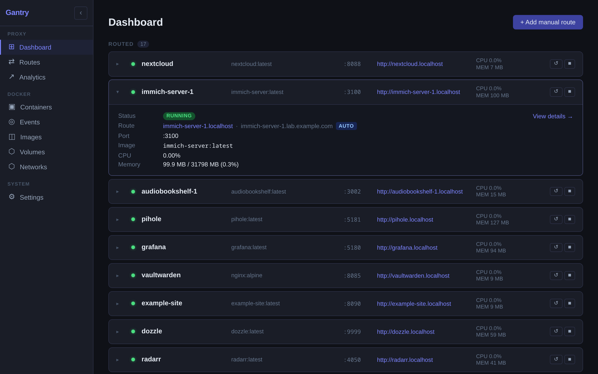
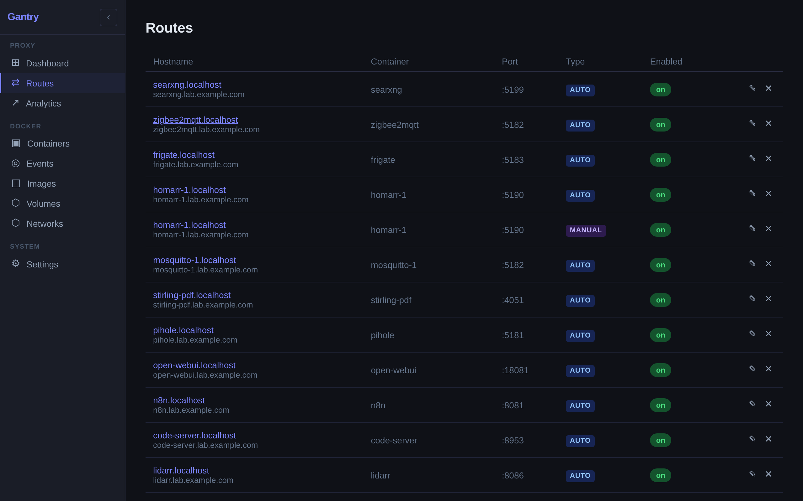
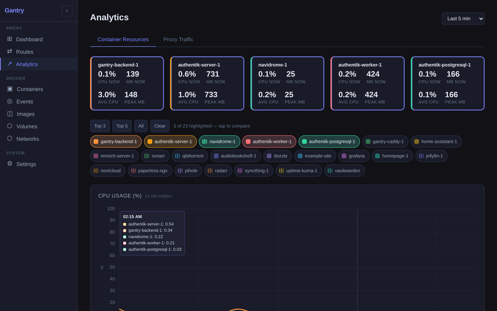
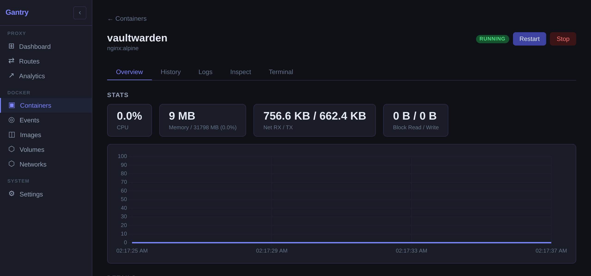
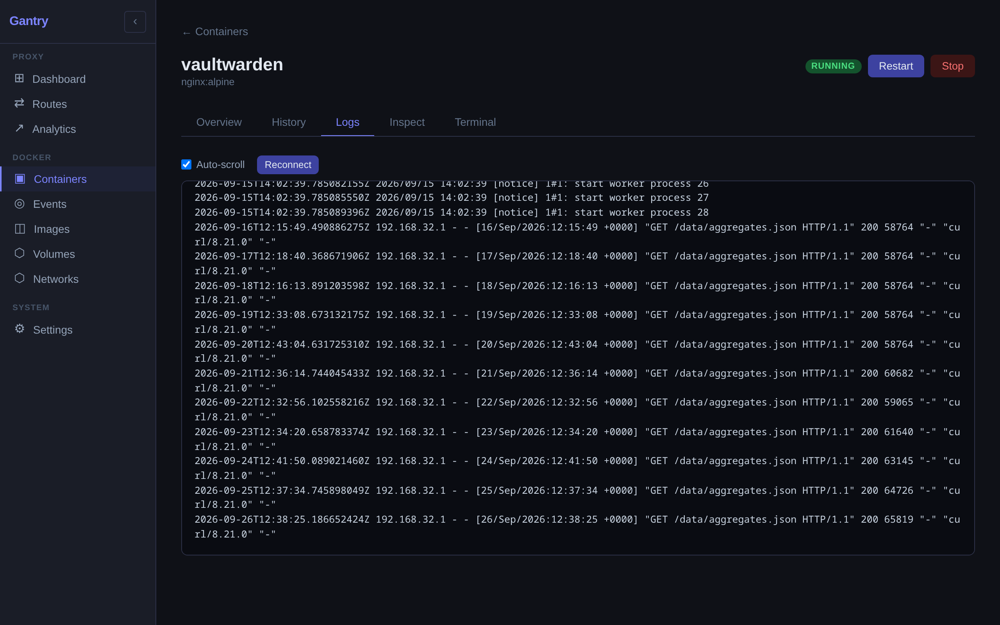
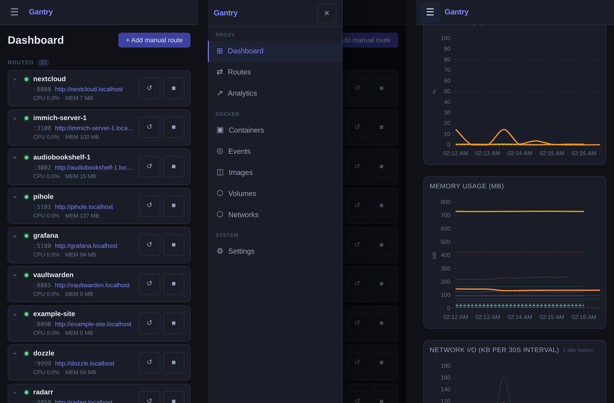
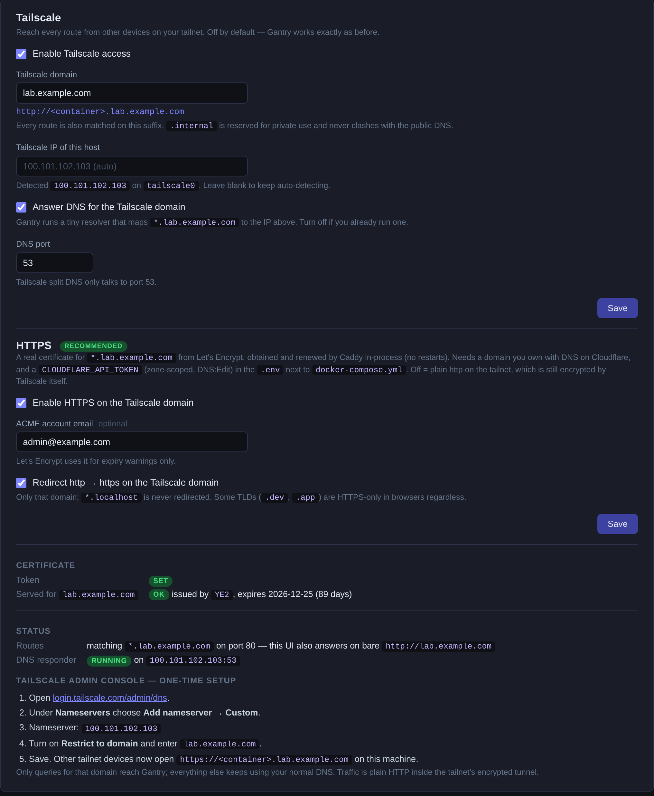

# Gantry

A local reverse proxy and Docker dashboard for your homelab. Gantry watches the Docker socket, gives every container with a published port a stable name like `http://jellyfin.localhost`, and puts routes, containers, logs, a terminal and resource charts in one web UI. Turn on Tailscale access and the same names work from your phone, with a real HTTPS certificate if you want one.



## What it does

- **Auto-discovers containers.** Start a container with a published port and `<name>.localhost` routes to it within a second. Stop it and the route stays visible as offline; start it again (even with a new container ID) and it comes back.
- **Manual routes** for anything that is not a container: a hostname and a port.
- **Reach it from your tailnet.** Enable Tailscale access and every route also answers on `<name>.<your-domain>` for any device in your tailnet. Gantry ships the DNS responder, so there is nothing else to run.
- **Real HTTPS on the tailnet names.** A Let's Encrypt wildcard via Cloudflare DNS-01, obtained and renewed by Caddy itself.
- **Docker management.** Start, stop and restart containers; live logs, a terminal, inspect output, per-container CPU / memory / network history; images, volumes, networks and the Docker event stream.
- **Analytics.** Proxy traffic per route and resource usage across containers, built to stay readable with dozens of them.
- **Phone-friendly.** The whole UI works on a phone in portrait or landscape.
- **Zero config to start.** One `docker compose up`. No YAML per service, no labels.

## Screenshots

| | |
|---|---|
|  **Routes** — every hostname, with the tailnet name alongside |  **Analytics** — pick the containers you want to compare |
|  **Container** — live stats, history, logs, inspect, terminal |  **Logs** — streamed, with auto-scroll |



## Quick start

Requirements:

- Docker with Compose, and access to `/var/run/docker.sock`
- Port **80** free (Caddy), plus **3001** (backend) and **2019** (Caddy admin API) on localhost
- Linux host. Gantry runs with `network_mode: host` so containers can be reached on the ports Docker publishes.

```bash
git clone https://github.com/awall451/gantry.git
cd gantry
docker compose up -d --build
```

Open **http://gantry.localhost**. Every running container that publishes a port is already listed with a link.

`*.localhost` resolves to `127.0.0.1` in every modern browser without any DNS setup. Nothing in Gantry touches your system's resolver.

## How routing works

1. The backend listens to Docker events (`start`, `die`, `destroy`).
2. On every change it upserts routes in SQLite, rebuilds the complete Caddy configuration and pushes it through Caddy's admin API in one atomic load.
3. `<container-name>.localhost` proxies to the container's first published port. Names are sanitised to valid DNS labels.
4. Routes can be renamed, disabled or deleted on the Routes page; manual routes can be added on the Dashboard.

The Gantry UI itself is always `gantry.<domain>` and is the first route.

## Access from your phone: Tailscale

Off by default; a stock install never touches Tailscale. Turn it on under **Settings → Tailscale** and every route becomes reachable from any device in your tailnet.



| Where you are | What you open |
|---------------|---------------|
| On the machine running Gantry | `http://<name>.localhost` (unchanged) |
| Any other tailnet device | `http://<name>.gantry.internal` (or your own domain) |
| The Gantry UI from the tailnet | `http://gantry.internal` |

### Setup

1. **Settings → Tailscale → Enable Tailscale access.** Keep the default domain `gantry.internal` or pick your own. `.internal` is reserved for private use, so it can never collide with a public name.
2. Leave the **Tailscale IP** blank. Gantry detects the `tailscale0` interface (or any `100.64.0.0/10` address) and shows what it found. Pin it only if the host has several.
3. Keep **Answer DNS for the Tailscale domain** on unless you already run a resolver for that zone. Gantry's responder binds UDP 53 on the Tailscale IP only.
4. Save. The **Status** block should show the responder running, and the page prints the last step with your values filled in:
5. **Tailscale admin console → DNS → Nameservers → Add nameserver → Custom.** Nameserver = this host's Tailscale IP. Turn on **Restrict to domain** and enter your domain. Save.

From a phone on the tailnet, open `http://gantry.internal`. The routes list now links to `*.gantry.internal`; on the laptop it keeps linking to `*.localhost`. Links follow the address you opened Gantry on, and both names are shown.

### How it works

Tailscale's MagicDNS names devices but has no wildcard records, so Gantry fills that gap:

- **Caddy** matches every route on the extra suffix. It already listens on all interfaces, so tailnet traffic reaches it on port 80 like any other.
- **A tiny built-in DNS responder** (dependency-free UDP A records) answers `*.<domain>` with the host's Tailscale IP and refuses everything else.
- **Tailscale split DNS** sends only queries for that domain to Gantry. All other names keep using your normal DNS.

Traffic is plain HTTP inside Tailscale's encrypted tunnel; nothing is exposed outside the tailnet. If the host is asleep the names simply do not resolve.

## HTTPS on the tailnet (optional, recommended)

Browsers still flag plain `http://`, and some apps (PWAs, clipboard, camera) require a secure context. **Settings → Tailscale → HTTPS** gets a real certificate:

1. Use a domain you own as the Tailscale domain, e.g. `lab.example.com`, with its DNS hosted on **Cloudflare**. Only your tailnet ever resolves names under it; public DNS never learns them.
2. Create a Cloudflare API token scoped to that one zone with permission **Zone → DNS → Edit**.
3. Put it in a `.env` next to `docker-compose.yml` (see `.env.example`):
   ```
   CLOUDFLARE_API_TOKEN=...
   ```
   Caddy reads it directly for the ACME challenge. Gantry never stores it; the Settings page only reports whether it is set.
4. `docker compose up -d` so Caddy sees the variable, then enable HTTPS in Settings. Caddy requests `*.lab.example.com` + the apex from Let's Encrypt over DNS-01 and **renews in-process**, with no restarts or cron.
5. Update the split-DNS entry in the Tailscale admin console to the new domain.

The Settings page shows the certificate currently served and its expiry, and warns when another process holds port 443 on the Tailscale address (a specific-address bind silently beats Caddy's wildcard bind; `tailscale serve` is the usual culprit).

Notes:

- The http→https redirect applies to the Tailscale domain only. `*.localhost` is always plain http; browsers already treat it as a secure context.
- TLDs such as `.dev` and `.app` are HTTPS-only in browsers (HSTS preload), so there is no plain-http fallback on them. If issuance ever breaks, switching the domain back to something like `gantry.internal` restores plain http immediately.

## Configuration reference

All settings live in the UI (**Settings**) and persist in SQLite. Defaults:

| Setting | Default | Meaning |
|---------|---------|---------|
| Base domain | `localhost` | Suffix for every route on this machine |
| Tailscale access | off | Also match routes on the Tailscale domain and run the DNS responder |
| Tailscale domain | `gantry.internal` | Second suffix; the zone the responder answers |
| Tailscale IP | auto | This host's Tailscale IPv4; blank = detect |
| Answer DNS | on | Run the built-in responder |
| DNS port | `53` | Tailscale split DNS only talks to 53 |
| HTTPS | off | `:443` with a Let's Encrypt wildcard for the Tailscale domain |
| ACME email | empty | Optional; Let's Encrypt uses it for expiry warnings |
| Redirect http→https | on | On the Tailscale domain only |

Environment (set in `docker-compose.yml`):

| Variable | Default | Purpose |
|----------|---------|---------|
| `PORT` | `3001` | Backend port |
| `CADDY_ADMIN` | `http://localhost:2019` | Caddy admin API |
| `DB_PATH` | `/app/data/proxy.db` | SQLite file (mounted from `./data`) |
| `LOG_PATH` | `/logs/access.log` | Caddy access log, tailed for analytics |
| `CLOUDFLARE_API_TOKEN` | empty | From `.env`; only needed for HTTPS |

Ports used on the host: `80` (and `443` with HTTPS) for Caddy, `2019` Caddy admin, `3001` backend, `53/udp` on the Tailscale IP when the responder is on.

## The UI

| Page | What you get |
|------|--------------|
| **Dashboard** | Every routed container with status, port, link and live CPU / memory; expand a row for details and actions |
| **Routes** | All auto and manual routes; rename, enable/disable, delete |
| **Analytics** | Container resources (CPU, memory, network) over a time range, and proxy traffic per route. Tap chips, cards or lines to choose which containers to compare; the selection is in the URL |
| **Containers** | Everything Docker knows about, routed or not; detail page with Overview, History, Logs, Inspect and Terminal tabs |
| **Events** | Docker start/stop/die/destroy events with exit codes |
| **Images / Volumes / Networks** | List and remove images and volumes; inspect networks |
| **Settings** | Base domain, Tailscale access, HTTPS, live status and the setup steps |

## MCP server

`mcp/` contains a Model Context Protocol server that exposes Gantry to an MCP client such as Claude Code: list routes, add aliases, check a service, and deploy or update a repo's compose stack and verify that Gantry picked it up. See [mcp/README.md](mcp/README.md).

## Development

```bash
./dev.sh            # Caddy in Docker, backend + frontend with hot reload
```

| Service | URL |
|---------|-----|
| UI (Vite HMR) | http://localhost:5173 |
| Backend API | http://localhost:3001/api |
| Proxy | http://\*.localhost |

Or individually:

```bash
cd backend && PORT=3001 CADDY_ADMIN=http://localhost:2019 DB_PATH=../data/proxy.db LOG_PATH=../logs/access.log npm run dev
cd frontend && npm run dev -- --port 5173
```

Frontend changes in production mode need `docker compose up -d --build`; the built assets are baked into the image.

### Tests

```bash
cd backend  && npm test          # unit + Docker integration (disposable containers)
cd frontend && npm test          # vitest
cd frontend && npm run e2e       # Playwright: every page at phone + desktop sizes, against a running server (BASE_URL)
```

See [CONTRIBUTING.md](CONTRIBUTING.md) for the TDD rules and test tiers.

## Architecture

```
 browser ──► Caddy :80/:443 ──► containers (published ports)
                │  ▲
   gantry.*     │  │ admin API :2019 (full config, atomic load)
                ▼  │
           backend :3001 ── Docker socket (events, stats, exec, logs)
             │   │   └───── SQLite (routes, settings, analytics)
             │   └───────── UDP :53 DNS responder (Tailscale domain)
             └── WebSocket ─► UI (routes:updated, container events, stats)
```

| Component | Tech |
|-----------|------|
| Reverse proxy | Caddy 2 (+ `caddy-dns/cloudflare`), configured through the admin API |
| Backend | Node.js, Express, dockerode, better-sqlite3, `ws` |
| Frontend | SvelteKit, Chart.js, xterm.js |
| Tests | vitest, supertest, Playwright |

All three services run with `network_mode: host`.

## Troubleshooting

- **Port 80 already in use.** Another proxy or web server is listening. Stop it, or change Caddy's port in `backend/src/caddy-client.js` (routes assume `:80`).
- **A container has no route.** It publishes no port (`docker ps` shows none), or it is on another host. Add a manual route if you know the port.
- **Two containers, one name.** Names are sanitised to DNS labels, so `my_app` and `my-app` collide; the second one is skipped. Rename one.
- **DNS responder shows a bind error.** `EACCES`: the backend is not root (it is, in the shipped image). `EADDRINUSE`: something else holds `53` on the Tailscale IP. `EADDRNOTAVAIL`: no Tailscale IP was found; is Tailscale up?
- **Tailnet names resolve on the laptop but not the phone.** Check the split-DNS entry: nameserver = the host's Tailscale IP, restricted to exactly the domain in Settings.
- **HTTPS never gets a certificate.** Token missing or wrong scope (`docker compose logs caddy` shows the ACME error), or port 443 is held by another process (Settings warns about this).
- **Analytics is empty for a new route.** The access log is aggregated a second or so after Caddy writes it.
- **Frontend or API calls fail with CORS from a `*.localhost` app.** The app hardcodes `localhost:PORT`; allow the `*.localhost` origin in its CORS config.

## Security notes

Gantry has **no authentication**. It controls your Docker daemon (start/stop, exec into containers, delete images and volumes). Keep it on `localhost` and your tailnet only; never publish port 80/443/3001 to the internet. The Cloudflare token is read by Caddy from `.env` and is never written to the database or shown in the UI.

## License

[MIT](LICENSE).
